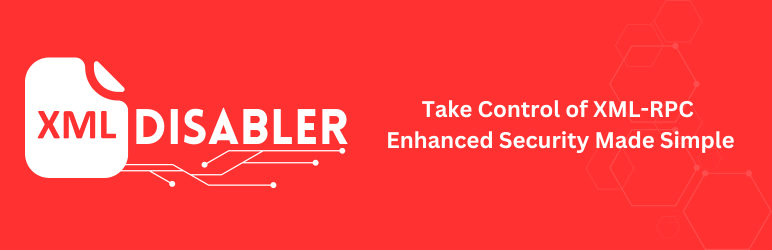

=== XML-RPC Disabler ===
Contributors: RED Media Corporation
Tags: xmlrpc, security
Requires at least: 5.0
Tested up to: 6.6
Stable tag: 1.0

A plugin to disable XML-RPC functionality for enhanced security, with logging options.

== Description ==

This plugin disables the XML-RPC functionality in WordPress to improve security against certain types of attacks. It also logs access attempts, providing an additional layer of security.

== Installation ==

1. Upload the `XML-RPC-Disabler` folder to the `/wp-content/plugins/` directory.
2. Activate the plugin through the 'Plugins' menu in WordPress.
3. Go to the plugin settings page to configure options and view access logs.

== Frequently Asked Questions ==

= What does this plugin do? =

This plugin disables XML-RPC functionality and logs any access attempts to xmlrpc.php.

= How can I view the access logs? =

You can view the access logs on the plugin settings page in the WordPress admin dashboard.

== Screenshots ==

1. Plugin Settings Page
2. Access Logs Display

== Changelog ==

= 1.0 =
* Initial release of the XML-RPC Disabler plugin.
